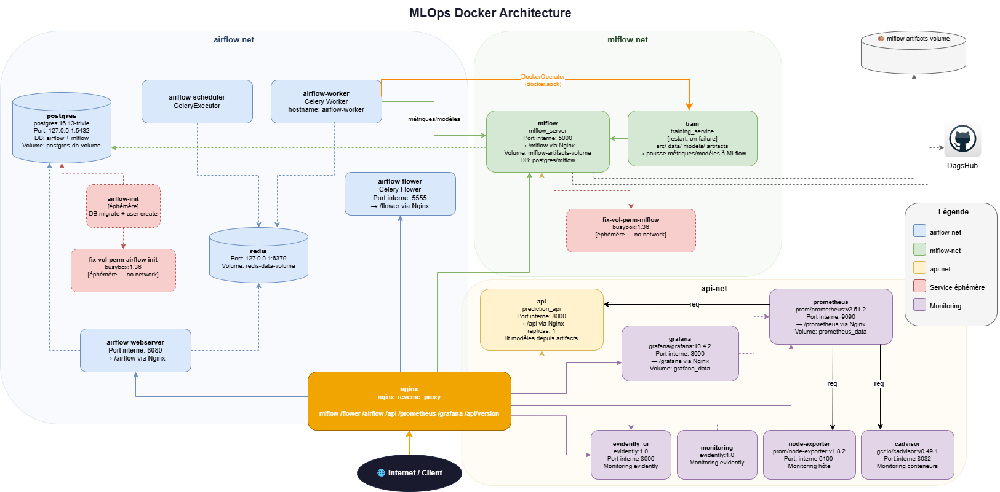

# MLOps – Accidents Severity Pipeline




Stack : **API · MLflow · Airflow · Prometheus · Grafana · Evidently**

---

## Prérequis

- VM Ubuntu avec **16 Go de RAM** et **24 Go de disque** (les services sont gourmands en ressources).
- Docker Compose et Buildx à jour (mis à jour automatiquement via `make install`).

---

## Installation

### Cloner le dépôt

```bash
git clone -b mlops_accidents https://github.com/sage-flfay/Template_MLOps_accidents.git
```

### Commandes disponibles

```bash
make          # Affiche toutes les commandes disponibles avec leur description
```

---

## Configuration avant de démarrer

### 1. DagsHub (S3)

Sur le repository, 
1. dans l'onglet  **Settings**, puis **Integrations** sélectionner **"S3 compatible"** et configurer 
2. dans l'onglet  **files**, puis **Data** pour récupérer les informations de connexion, descendre jusqu'à **Setup credentials** pour récupérer le access_access_key et le secret_access_key.

### 2. Evidently (alerte de drift)

Pour que les alertes de drift soient transmises à un webhook :
1. Aller sur https://webhook.site/ et copier le lien généré.
2. Renseigner ce lien dans `docker-compose.yml`, service `grafana`, variable `GF_WEBHOOK_URL`.

> Le lien webhook.site a une durée de vie limitée. S'il devient inactif (trop de messages, expiration), en générer un nouveau (ouvrir le site en navigation privée si l'ID ne change pas) et mettre à jour `GF_WEBHOOK_URL` avant de relancer le service `grafana`.

---

## Démarrage complet (machine vierge)

### 1. Configurer les credentials DagsHub

```bash
make install
```

La commande s'interrompt pour demander les clés S3 DagsHub. Suivez les instructions affichées. Les clés se trouvent dans DagsHub  /  **Data  /  S3 Credentials**.

> Les saisies sont masquées (comme pour un `git push`).

### 2. Finaliser l'installation

```bash
make install
```

Relancer après avoir renseigné les clés : l'installation complète s'exécute.

### 3. Construire les images Docker

```bash
make docker-FullClean-full-build
```

Cette commande :
- Supprime tous les conteneurs et volumes existants
- Demande les identifiants Airflow (entrée vide  /  `admin` / `admin` par défaut)
- Demande le mode de déploiement : **debug** (HTTP) ou **prod** (HTTPS)
- Construit toutes les images nécessaires
- Affiche un récapitulatif des images créées et l'utilisation des ressources de la VM

### 4. Démarrer les services

```bash
make docker-full-start-WoInitialTrain_fast
```

Démarre tous les services de façon optimisée. Inclut automatiquement un reset complet (`docker-reset-for-full-simu`) pour une simulation cohérente.
Affiche les URLs d'accès aux interfaces web et l'état des ressources.

---

## Pipelines Airflow

Deux DAGs sont disponibles :

| DAG | Description |
|---|---|
| `dvc_accidents_severity_WoDvcTrackPush` | Exécute le pipeline sans hash du modèle ni `dvc push`. Dans FastAPI, le bouton "Mettre à jour le modèle" récupère directement le modèle depuis MLflow local (rapide). |
| `dvc_accidents_severity` | Exécute le pipeline complet avec hash du modèle et `dvc push` vers le S3 DagsHub. Dans FastAPI, le bouton "Mettre à jour le modèle" interroge le S3 pour récupérer le modèle (plus long). |

Chaque DAG exécute, via des `DockerOperator` basés sur l'image `accidents_severity-runner` : initialisation de la base, puis les étapes du `dvc.yaml` (`import`, `process`, `train`, `evaluate`, et `dvc_hash` + `dvc push` uniquement pour `dvc_accidents_severity`), suivies de la mise à jour de version sur DagsHub.

---

## Simulation de drift (Evidently)

```bash
make drift-on    # Bascule fastapi_data.csv vers le jeu de données simulant un drift
make drift-off   # Revient au fastapi_data.csv d'origine, le drift disparaît
```

- Evidently surveille le fichier `data/users/fastapi_data.csv` (vérification toutes les 30s).
- En cas de drift détecté, le statut et le score sont écrits dans `data/evidently/full_drift_status.json`, exposés par l'API via `/metrics`, puis remontés à Prometheus et Grafana (alarme firing/resolved envoyée au webhook).

---

## Commandes courantes

| Commande | Description |
|---|---|
| `make docker-reset-for-full-simu` | Force la regénération de tous les modèles via Airflow (inutile au premier démarrage) |
| `make docker-status` | Affiche l'état des services et les ports actifs |
| `make ubuntu_usage` | Affiche l'utilisation RAM / Disque / CPU par service |
| `make quality` | Vérifie la conformité PEP8 (black / flake8) |
| `make drift-on` / `make drift-off` | Active / désactive la simulation de drift |

---

## Configuration

### Changer l'année de simulation

Dans l'interface Airflow  /  **Admin  /  Variables**, mettre à jour la variable `année`.
Valeurs autorisées : `2019`, `2020`, `2021`, `2022`, `2023`, `2024`.

### Temps de génération des modèles

- Modèle inexistant : environ **1 min 30 à 2 min**
- Modèle déjà présent : moins d'**1 min** (vérifications uniquement)

---

## Architecture des services

### Docker Compose

| Service | Rôle |
|---|---|
| **Postgres** | Base de données (utilisée aussi par Airflow) |
| **Nginx** | Point d'entrée unique, reverse proxy, rate limiting, redirection HTTP / HTTPS |
| **MLflow** | Tracking des expériences et gestion des modèles (MLflow 3.x) |
| **API** | Service de prédiction (FastAPI) |
| **train** *(job)* | Entraînement du modèle (éphémère, `on-failure` restart) |
| **fix-volumes-permissions** *(job, lancé en premier)* | Attribue les droits/permissions corrects (utilisateur non root, 755) aux volumes créés par Docker |

### Monitoring

- **Prometheus** : collecte des métriques applicatives, VM (`node-exporter`), conteneurs (`cAdvisor`) et drift (`scrape_interval` / `evaluation_interval` : 5s)
- **Grafana** : dashboards pour la VM, les conteneurs, et l'application (incluant un panel double pour le statut et le score de drift)
- **Evidently** : détection de drift sur les données de prédiction (image dédiée, nécessaire car la version utilisée ne supporte que `numpy < 2.0`)

---

## Sécurité

- **HTTPS/443** activé en mode prod via Nginx
- **Rate limiting** configuré dans Nginx
- **Droits utilisateur** (non root) dans les conteneurs Docker, permissions `755`
- **Credentials DagsHub** transmis via `export` (non stockés dans `.env`)
- **Secrets GitHub Actions** configurés via `DAGSHUB_ACCESS_KEY_ID` et `DAGSHUB_SECRET_ACCESS_KEY`
- Certificats montés en lecture seule (`:ro`)

---

## Reproductibilité

- Versions d'images Docker fixées (pas de `latest`)
- Dépendances verrouillées via `uv.lock` (`uv sync --frozen`)
- Sélection automatique du meilleur modèle basée sur le KPI **Recall Grave**

---

## Scalabilité

- Le `docker-compose.yml` inclut la directive `replicas` sur le service API.
- Le load balancing est géré automatiquement par Nginx.
- Pour scaler : augmenter `replicas` et supprimer `container_name: prediction_api`.

> Si Kubernetes est installé, il peut réserver les ports 80 et 443. Vérifier avec `make docker_check_port_routage`.

---

## Organisation du projet
   
```
Template_MLOps_accidents
├── Dockerfile                          <- image de base / runner pour les jobs DockerOperator Airflow
├── LICENSE
├── Makefile                            <- point d'entrée des commandes (make install, make docker-*, make drift-on/off, etc.)
├── README.md
├── data
│   ├── evidently                       <- état et rapports de monitoring de drift
│   │   ├── accidents_severity-ws       <- workspace Evidently
│   │   ├── full_drift_status.json      <- statut/score de drift courant, exposé par l'API via /metrics
│   │   ├── heartbeat.txt                <- horodatage pour vérifier que le daemon Evidently est actif
│   │   └── reports
│   │       ├── drift_report_2026-06-10.html   <- rapport détaillé de drift généré par Evidently
│   │       └── test_suite_2026-06-10.html     <- suite de tests Evidently associée
│   ├── mlruns_latest                   <- artefacts/run MLflow les plus récents (volume partagé)
│   ├── preprocessed                    <- données prêtes pour l'entraînement
│   ├── raw                             <- données brutes importées (caractéristiques, lieux, usagers, véhicules)
│   └── users
│       └── fastapi_data.csv            <- données de prédiction temps réel, surveillées par Evidently (toutes les 30s)
├── deployments
│   ├── airflow
│   │   ├── Dockerfile                  <- image du conteneur Airflow
│   │   ├── README.md                   <- doc spécifique Airflow
│   │   ├── dags
│   │   │   ├── __init__.py
│   │   │   ├── dvc_accidents_severity.py              <- DAG complet : pipeline + hash modèle + dvc push (S3 DagsHub)
│   │   │   └── dvc_accidents_severity_WoDvcTrackPush.py <- DAG sans push, mise à jour modèle via MLflow local (rapide)
│   │   ├── logs                        <- logs d'exécution des DAGs
│   │   └── plugins                     <- plugins Airflow custom (vide ou en réserve)
│   └── nginx
│       ├── Dockerfile
│       ├── certs                       <- certificats TLS (montés en lecture seule, à garder en local)
│       │   ├── nginx.crt
│       │   └── nginx.key
│       ├── nginx.conf                  <- config mode prod (HTTPS/443)
│       └── nginx_debug.conf            <- config mode debug (HTTP/80)
├── docker-compose.yml                  <- orchestration de tous les services (Postgres, Nginx, MLflow, API, train, monitoring...)
├── dvc.lock                            <- état figé du pipeline DVC (versions des données/modèles)
├── dvc.yaml                            <- définition des stages DVC (import, process, train, evaluate, dvc_hash...)
├── logs                                <- logs généraux du projet
├── mlflow-logrotate.conf               <- rotation des logs du service MLflow
├── models
│   └── model.joblib                    <- modèle entraîné sérialisé (échangé actuellement via volume partagé avec MLflow/API)
├── monitoring
│   ├── grafana
│   │   ├── dashboards_json             <- dashboards importés
│   │   │   ├── VMusage-dashboard.json       <- usage RAM/CPU/disque de la VM (node-exporter)
│   │   │   ├── accidents-dashboard.json     <- dashboard métier + drift (double panel statut/score)
│   │   │   └── containers-dashboard.json    <- monitoring des conteneurs (cAdvisor)
│   │   └── provisioning
│   │       ├── alerting
│   │       │   ├── alert_drift.yaml         <- règle d'alerte de drift
│   │       │   ├── contact_points.yaml      <- destinataire de l'alerte (webhook.site)
│   │       │   └── notification_policies.yaml <- délais d'envoi firing/resolved (10s puis 20s)
│   │       ├── dashboards
│   │       │   └── dashboard.yml            <- provisioning auto des dashboards
│   │       └── datasources
│   │           └── datasource.yml           <- connexion Grafana → Prometheus
│   └── prometheus
│       ├── prometheus.yml              <- config scrape (5s) : API, node-exporter, cAdvisor
│       └── rules
│           └── alert_rules.yml         <- règles d'alerte Prometheus (dont drift)
├── notebooks
│   └── 1.0-ldj-initial-data-exploration.ipynb  <- exploration initiale (non utilisé en prod)
├── params.yaml                         <- hyperparamètres / paramètres du pipeline DVC
├── pyproject.toml                      <- config Python du projet (Python 3.12)
├── references                          <- répertoire non utilisé (hérité du template)
├── reports
│   ├── figures                         <- graphiques générés (non utilisé activement)
│   └── metrics.json                    <- métriques du modèle (dont Recall Grave, utilisé pour le best model)
├── requirements.txt                    <- dépendances Python (sert à régénérer pyproject.toml/uv.lock si besoin)
├── setup.cfg
├── setup_daemon_json.sh                <- script de config Docker daemon (utilisé par make install)
├── setup_dagshub_key.sh                <- script de saisie/export des clés DagsHub (S3)
├── simu_data_drift
│   └── fastapi_data_ForDriftAlerterDemo.csv  <- jeu de données simulant un drift (utilisé par make drift-on)
├── simu_data_web                       <- jeux de données annuels (2019-2024) simulant l'arrivée de nouvelles données via Airflow
│   ├── caracteristiques-20XX.csv
│   ├── lieux-20XX.csv
│   ├── usagers-20XX.csv
│   └── vehicules-20XX.csv
├── src
│   ├── __init__.py
│   ├── api                              <- service FastAPI de prédiction
│   │   ├── Dockerfile
│   │   ├── __init__.py
│   │   ├── config.py
│   │   └── main.py                     <- endpoints (prédiction, mise à jour modèle, /metrics)
│   ├── config                          <- répertoire vide/réservé pour config additionnelle
│   ├── data
│   │   ├── __init__.py
│   │   ├── check_structure.py
│   │   ├── import_raw_data.py          <- import des 4 datasets bruts
│   │   └── make_dataset.py             <- préprocessing raw → preprocessed
│   ├── features
│   │   ├── __init__.py
│   │   └── build_features.py           <- feature engineering
│   ├── html
│   │   └── TemplateInterfaceWeb.html   <- interface web simple servie par l'API
│   ├── mlflow
│   │   ├── Dockerfile
│   │   ├── dagshub_upd_version.py      <- versionnement sur DagsHub (appelé par Airflow)
│   │   └── dvc_tracker.py              <- gestion du hash modèle / suivi DVC
│   ├── models
│   │   ├── Dockerfile
│   │   ├── __init__.py
│   │   ├── evaluate_model.py           <- calcul des métriques (Recall Grave, sélection best model)
│   │   ├── predict_model.py
│   │   └── train_model.py
│   ├── monitoring                      <- service de détection de drift
│       ├── Dockerfile                  <- image dédiée (numpy < 2.0 requis pour Evidently 0.6.7)
│       ├── check_health.py
│       ├── evidently_monitor.py        <- calcul du drift Evidently
│       ├── evidently_monitor_daemon.py <- boucle de surveillance (check toutes les 30s)
│       ├── pyproject.toml
│       └── uv.lock
│   
└── uv.lock                              <- verrouillage des dépendances (uv sync --frozen)
```

---

## Travaux en cours

- [ ] Échange du modèle MLflow via HTTP (actuellement via volume partagé)
- [ ] Stockage du modèle entraîné directement sur DagsHub
- [ ] Déploiement **Kubernetes**
- [ ] un requirement / docker image
